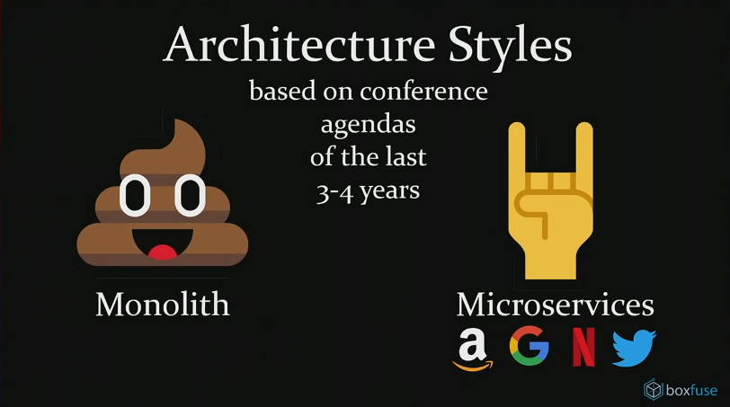
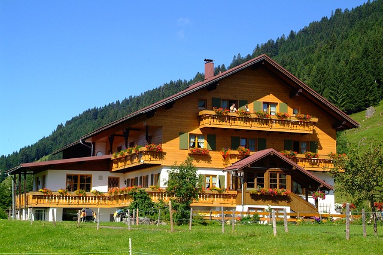

layout: true

background-image: url(img/logo.png)
background-size: 7%
background-repeat: no-repeat
background-position: top 15px right 30px

---
class: middle center

# Czy monolit może być skalowalny? 

---

## O mnie

#### &nbsp;&nbsp;Marek Gleska

* od 10.2022 w PGS Software / Xebia – Senior PHP Developer
* od 2021 jako Developer
* tech lead / delivery manager / product owner, serwery, sieci, kierownik zespołu wsparcia
* od 1989 interesuję się Inżynierią Oprogramowania
* w wieku 15 lat (1987) pierwsza gra typu snake (na ZX Spectrum)
--
.right[]

???

W tamtych latach Inżynieria Oprogramowania zajmowała się zagadnieniami z otoczenia programowania, takimi jak:

* architektura systemu,
* wybór algorytmów
* ocena wydajności
* organizacja zespołów programistów
* ekonomika eksploatacji i rozwoju systemu

---

  

## .center[Agenda]

* Co skłoniło mnie do przygotowania tej prezentacji?
* FastCGI Process Manager (FPM), skalowanie w stylu PHP.
* Czy monolit może być skalowalny?
* Obliczenia na odwrocie koperty.
* Podsumowanie
* Q&A

???
pytania na koniec, w takcie można na czacie zapisać nr slajdu i hasłowo czego dotyczy pytanie

---

  

## Co jest lepsze?

* autobus
* samochód osobowy
* rower

--

Ale do czego?

---

  

## Co jest lepsze?

* architektura mikroserwisowa
* architektura monolityczna

--
   

.center[]
.center[Majestic Modular Monoliths by Axel Fontaine, listopad 2018]

---

## Te straszne monolity

* Monolit jest straszny, bo jest legacy.
* Trzeba go pociąć na mikroserwisy, które są lepsze.
* Jak wyjdziemy z monolitu, to nasz system będzie skalowany.
* Słownictwo:
  * legacy – takie coś straszne, brzydzimy się tym
  * monolit &hArr; legacy
  * zlepek źle zrobionych mikroserwisów nazywany jest „rozproszonym monolitem”

--

.center[]

???

legacy – dziedzictwo, spuścizna, spadek po kimś

Czy gdy otrzymamy w spadku np. pensjonat nad jeziorem wart 10 MLN złotych, to od razu myślimy o tym jak tu pociąć go na małe domki letniskowe albo pozbyć się go w inny sposób?

Czy raczej zbadamy jego kondycję finansową, stan budynku, przychody roczne jakie generuje i konieczne nakłady (czyli koszty) jakie trzeba ponosić aby utrzymać go w działaniu i dobrym stanie?

W IT taki spadek/dziedzictwo ma znaczenie wyłącznie negatywne. Nie zgadzam się z tym, ale skoro większość tak mówi, to trzymajmy się tego znaczenia.

Inny obserwowany na konferencjach trend to utożsamianie monolitu z legacy. Bez podania uzasadnienia. Monolit jest legacy, legacy jest monolitem.

Pokłosiem takiego utożsamienia jest lansowanie przez niektórych prelegentów określenia "rozproszony monolit". Który ma opisywać zlepek źle zrobionych mikroserwisów. Bo zgodnie z konferencyjnym zwyczajem, mikroserwisy są zawsze dobre, więc źle zrobione muszą mieć jakąś inną nazwę, niekojarząca się z mikroserwisami.

Z takim trendem nazewniczym zdecydowanie się nie zgadzam. Powinna być używana właściwa nazwa, czyli mikroserwisy legacy.

---

## Mikroserwisy są super, ale ...

Jeżeli budujemy system z mikroserwisów, to pojawią się problemy (wyzwania).
  * komunikacja przez sieć jest zawodna
    * utrata komunikatu
    * powtórzenie komunikatu
    * komunikacja synchroniczna MS &rarr; MS ma stałe opóźnienie nie mniejsze niż 3-5 ms i ograniczoną przepustowość
  * potrzeba observability
    * skorelowanie logów z wielu MS
    * śledzenie przebiegu obsługi jednego żądania przez kilka MS
  * związane z chwilową lub długotrwałą niedostępnością innego mikroserwisu,
    * retransmisja, regulacja natężenia retransmisji
    * inteligentne zaprzestanie retransmisji (circut breaker) i wznowienie komunikacji
    * reguły biznesowe działania przy niedostępności danego MS

---

## Mikroserwisy są super, ale ... [2]

  * kontrakty między MS
    * uzgodnienie i utrzymanie katalogu kontraktów
    * testy kontraktów
  * testy integracyjne między MS (Boiling Frogs 2024 | Piotr Przybył | O piramidzie testów i jakości życia)
  * czasowa niespójność baz danych różnych MS
    * nazywana marketingowo „ostateczną spójnością” (eventual consistency)
    * powinna być uwzględniona w regułach biznesowych

---

## Mikroserwisy są super, ale ... [3]

 
Zespół budujący system na mikroserwisach może mieć co najwyżej 1 juniora na 6-u seniorów. (źródło: Jakub Nabrdalik, prezentacja dla gildii Java, 2024-04-03)

Pojawiają się prezentacje i szkolenia mówiące o źle podzielonych mikroserwisach (nowa kategoria legacy) i konieczności ich przebudowy na prawidłowe mikroserwisy – hasło klucz: *bounded context* (na przykład: Sławek Sobótka, prezentacja dla gildii Java, 2023-03-07)

---

## Mikroserwisy są super, ale ... [4]

 
Z powyższymi wyzwaniami można się zmierzyć, co wymaga:
  * pracy,
  * czasu,
  * pieniędzy.

Albo udawać, że ich nie ma. Taka taktyka działa przez jakiś czas, gdy jesteśmy w fazie PoC (nazywanej także MVP – minimum viable product).

---

## A tymczasem stary dobry monolit …

Monolity od zawsze były budowane w formie modularnej. 
Podział na moduły i zamykanie w nich funkcjonalności odbywa się według zasad analogicznych jak dla mikroserwisów (bounded context). (zobacz: Dennie Van Tassel, Praktyka programowania, WNT 1982, strony 71-77)

Komunikacja między usługami/modułami w monolicie jest niezawodna i 1000x szybsza niż komunikacja synchroniczna (REST, gRPC, GraphQL) między mikroserwisami.

Zmiana interfejsu w jednym module niekompatybilna z użyciem tego interfejsu w innym module może być łatwo wykrywana przez IDE lub narzędzia (np. PHPStan).

---

## A tymczasem stary dobry monolit … [2]

Analiza awarii jest łatwiejsza, bo stack trace w logu może zawierać cały stos wywołań, przekrojowo przez wszystkie zaangażowane moduły.

W razie potrzeby, wybrane moduły mogą pracować w trybie asynchronicznym (kolejka komunikatów, cron), czyli analogicznie jak samodzielny mikroserwis.

---

## A tymczasem stary dobry monolit … [3]

Zalety monolitu (względem mikroserwisów):

* brak opóźnień w komunikacji &rArr; wynik jest dostarczany w krótszym czasie
* niezawodna komunikacja &rArr; nie trzeba przygotować obsługi błędów komunikacji (programistycznej oraz na poziomie logicznym)
* automatyczna kontrola zależności kodu/interfejsów &rArr; łatwiejszy refactoring
* &rArr; mniejsza złożoność systemu
* &rArr; łatwiejsze wprowadzanie zmian
* &rArr; niższy próg wejścia dla nowych programistów
* &rArr; możliwość zatrudniania junior/mid w większym udziale procentowym
* &rArr; niższe koszty utrzymania (maintenance) i rozwoju

---

## A tymczasem stary dobry monolit … [4]

Potencjalne wady monolitu:

* brak skalowalności
* jest duży i zajmuje dużo zasobów
* jest legacy
* nie jest trendy
* słabo wygląda w CV
* klienci go nie chcą

--

SPRAWDZAM !

---

## FastCGI Process Manager (FPM) &nbsp;&nbsp;&nbsp;&nbsp;&nbsp;

.center[]

https://www.php.net/manual/en/install.fpm.php

---

## FastCGI Process Manager (FPM) [2]

.center[]

---

## FastCGI Process Manager (FPM) [3]

.center[]

---

## Skalowanie pionowe FPM

.center[]

???

Moment! Jaki procesor ma 100 rdzeni CPU?

Otóż nie potrzebujmy 100 rdzeni CPU. Bo nasze procesy backend zwykle na coś czekają – dane z bazy danych, z innego MS, z cache Redis, a czasami na dane z dysku.

W związku z tym możemy jeden FPM może przyjąć więcej zadań niż ma dostępnych rdzeni CPU.

Oczywiście poza przypadkami, gdy nasze przetwarzanie intensywnie używa CPU – np. liczenie bitcointów, uczenie maszynowe, optymalizacja kombinatoryczna.

---

## Skalowanie poziome FPM

.center[]

---

## Skalowanie poziome FPM [2]

.right[]

Metryki dla skalowania:

* wypełnienie RAM (z przydzielonego)
* zużycie CPU (z przydzielonego)
* % aktywnych procesów wykonawczych (względem ustawionego max.)

---

## Skalowanie pionowe monolitu

  

Tak! To jego naturalne środowisko.

---

## Skalowanie poziome monolitu

Czynniki będące blokerem skalowania poziomego na wiele PODów:

* blokady w oparciu o pliki – flock()
* dane w plikach lokalnych VM/PODa
* session_start()
* inter-process communication (IPC)
  * signal
  * unix domain socket
  * named pipe
  * shared memory
  * semaphore
* specjalizowane rozszerzenia np. Swoole
* cron jobs

---

## Skalowanie poziome monolitu [2]

Zidentyfikowane blokery można zastąpić alternatywnymi rozwiązaniami dostosowanymi do pracy w środowisku rozproszonym, na przykład:

* flock() &rarr; Symfony Lock + RedisStore
* dane w plikach lokalnych &rarr; AWS EFS, AWS S3
* signal &rarr; kolejka RabbitMQ
* unix domain socket, named pipe &rarr; network socket
* cron jobs &rarr; zapewnić jedną aktywną instancję

Po usunięciu blokerów monolit może być skalowany poziomo analogicznie jak mikroserwisy.

---
## Czy monolit może być skalowalny?

--

Zdecydowanie TAK!

Brak technicznych przeszkód do skalowania poziomego systemu zbudowanego w architekturze monolitycznej.

--

Wybierając architekturę monolitu nie musimy mierzyć się z problemami/wyzwaniami które są nieodłącznym elementem systemu zbudowanego na mikroserwisach. 

Czyli przede wszystkim nie dotyka nas cała rodzina problemów związanych z zawodną komunikacją.
.right[]

--

Trzeba jednak pamiętać o tym, że zasób wspólny dla wielu instancji monolitu (zazwyczaj jest to baza danych) będzie czynnikiem utrudniającym/blokującym skalowanie powyżej pewnego poziomu.

---

### Czy monolit z modułami zużyje więcej pamięci niż mikroserwisy?

.center[]

???

Niech MS składa się z 40 klas usługowych o nazwach Srv01 … Srv40.

Niech Srv01 ma w zależnościach Srv02 ... Srv20 (bezpośrednio lub w drabince Srv02 &rarr; Srv03 &rarr; … &rarr; Srv20).

Niech Srv21 ma w zależnościach Srv22 … Srv40.

Mamy więc 2 grupy usług, gdzie każda grupa jest niezależna od drugiej.

Niech kontroler Controller zawiera metody obsługi dla ścieżek:

  * /create – używa Srv01
  * /get – używa Srv21

---

### Czy monolit z modułami zużyje więcej pamięci niż mikroserwisy? [2]

.center[]

---

### Czy monolit z modułami zużyje więcej pamięci niż mikroserwisy? [3]

.center[]

???

Uwaga! Powyższe działanie jest specyfiką PHP. Dla języków kompilowanych (np. Java, Golang), do pamięci ładowany jest cały kod wykonywalny powstały ze skompilowania
wszystkich modułów (ze wszystkich /src i ich zależności).

---

### Czy monolit z modułami zużyje więcej pamięci niż mikroserwisy? [4]

Przygotujmy środowisko PROD z użyciem Symfony:

    APP_ENV=prod
    composer install --no-dev --optimize-autoloader
`get_included_files()` pokaże nam, że dla wykonania działań endpointu `/create`, z katalogu `/src/Service` odczytane są tylko te pliki PHP, które definiują klasę Srv01 i jej zależności.

Dzieje się tak pod warunkiem, że w klasie Controller używamy wstrzykiwania zależności przez parametry (czyli nie w konstruktorze):

    #[Route('/create')]
    public function create(Srv01 $srv01): Response

---

### Monolit może dać oszczędności

Mikroserwis:
* 2 endpointy
* 40 klas
* 500 MB RAM
* 0,2 vCPU
* 20 procesów wykonawczych

System:
* 10 mikroserwisów
* 200 aktywnych procesów wykonawczych
* 5000 MB RAM
* 2 vCPU

???

Weźmy system złożony z 10-u mikroserwisów o strukturze opisanej wcześniej (2 endpointy, 40 klas).

Każdy POD każdego MS ma przydzielone 500 MB pamięci RAM i 0,2 vCPU.

Pojedynczy POD może uruchomić 20 procesów wykonawczych.

Wobec tego cały system łącznie ma:
* 200 aktywnych procesów wykonawczych
* 5000 MB RAM
* 2 vCPU

---

### Monolit może dać oszczędności [2]

Monolit realizujący te same funkcjonalności:
* 10 modułów
* 20 endpointów (po 2 w module)
* 400 klas (po 40 w module)

POD bazowy:
* 1000 MB RAM
* 0,4 vCPU
* 40 procesów wykonawczych

System:
* 2 PODy
* 80 procesów wykonawczych
* 2000 MB RAM
* 0,8 vCPU

---

###	Monolit może dać oszczędności [3]

Rozważmy scenariusz, gdy dla jednego wybranego endpointu GET obciążenie stopniowo narasta, aż do poziomu 100 jednocześnie otwartych żądań.

Mikroserwisy:
* 9 MS w spoczynku (stan bazowy) &rarr; brak aktywności
* MS obsługujący GET &rarr; 120 procesów wykonawczych, 6 PODów
* (6+9) × 500 MB = 7500 MB RAM
* (6+9) × 0,2 vCPU = 3 vCPU
* (6+9) × 20 = 300 procesów wykonawczych

Monolit:
* potrzeba 120 procesów wykonawczych &rarr; 3 PODy
* 3 × 1000 MB = 3000 MB RAM
* 3 × 0,4 vCPU = 1,2 vCPU
* 3 × 40 = 120 procesów wykonawczych

???

Ponieważ POD tego MS skaluje procesy wykonawcze w porcjach po 20, to dla obsługi 100 jednocześnie otwartych żądań potrzeba 6 PODów (5 to za mało, bo 20x5 to dokładnie 100, a autoscaler zawsze musi mieć jakiś zapas wolnych procesów wykonawczych).

---

## Szacowanie systemu klasy MyWork

Wymagania biznesowe:

* 5000 aktywnych użytkowników
* każdy użytkownik 1x dziennie korzysta z systemu (w celu zapisania czasu pracy)
* aktywność użytkowników ma miejsce między 15:00 a 17:00

Szacowanie:

* rejestracja czasu pracy wymaga średnio 10 interakcji FE &rarr; BE
* 5 000 × 10 = 50 000 req / 2 godziny
* 50 000 / (2 × 3 600) = 6,94 req / sec
* 500 ms na obsługę jednego requestu
* wystarczy ~10 procesów wykonawczych PHP

---

## Szacowanie systemu do spedycji krajowej

Wymagania biznesowe:

* 200 000 przesyłek na miesiąc
* aktywność użytkowników ma miejsce między 8:00 a 12:00

Szacowanie:

* rejestracja przesyłki i utworzenie listu przewozowego wymaga średnio 50 interakcji FE &rarr; BE
* 20 dni roboczych w miesiącu
* 200 000 / 20 / 4 = 2 500 przesyłek / godzinę  
* (2 500 × 50) / 3 600 = 34,72 req / sec
* 500 ms na obsługę jednego requestu
* wystarczy ~35-40 procesów wykonawczych PHP

---

## Podsumowanie

Architektura monolityczna ma swoje zalety i warto brać ją pod uwagę alternatywę dla bardziej popularnych mikroserwisów.

Monolit jest skalowany (do pewnej granicy).

Jeżeli jako architekturę wybieramy mikroserwisy (albo jest to stan zastany, na który nie mamy wpływu), to nie należy stosować metody strusia dla problemów, które są nieodłączną częścią tej architektury.

---

## Q & A

Krótka ankieta: https://forms.gle/XQbVgqcDefAm9csJ7

Prezentacja: https://mgleska.github.io/CzyMonolitMozeBycSkalowalny/

Kod do badania `get_included_files()`: https://github.com/mgleska/CzyMonolitMozeBycSkalowalny

Majestic Modular Monoliths by Axel Fontaine: https://youtu.be/BOvxJaklcr0?si=9qDhk6zrP6hqHtAD
